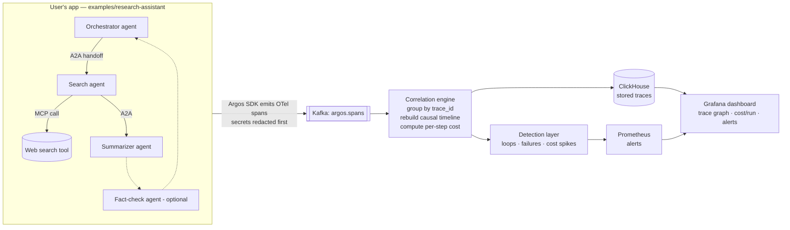

# PROJECT.md — Argos Source of Truth

> The six planning docs in one file, adapted for an **infrastructure** project.
> Put this at `/docs/PROJECT.md`. The README.md is the canonical source; this is
> the distilled, build-oriented version. 🔧 = a decision you should confirm.
>
> Note on the template: Argos isn't a typical web app, so two sections are
> reinterpreted — "App Flow" became **Trace/Data Flow** (the arrow diagram), and
> "Backend Schema" became the **span + ClickHouse schema**. "UI/UX" is
> deliberately thin because the README says build the dashboard last.

---

## 01 — PRD (Product Requirements)

**Name:** Argos — Distributed Tracing for Multi-Agent AI Systems
**Tagline:** The black-box flight recorder for teams of AI agents.

**Problem:** When one request fans out across multiple cooperating agents (over
MCP and A2A), a wrong final answer comes with no map of the dozen steps that
produced it. Existing tools trace a *single* agent well; the multi-agent story
scatters and nobody can reassemble it. Argos fills that gap.

**Who it's for:** platform/infra engineers, SRE/DevOps, AI engineering teams
shipping multi-agent features, and FinOps/cost owners. Anyone running **more than
one** cooperating agent.

**One-sentence pitch:** An OpenTelemetry-native distributed tracing system that
reconstructs the full execution of multi-agent AI systems communicating over MCP
and A2A — surfacing causal failure chains, runaway loops, and per-run cost that
single-agent tools miss.

**Must-have (v1):**
- Python SDK that emits an OTel span per agent step, installable, 2–3 lines to adopt
- Secret redaction in the SDK before anything leaves the machine
- Kafka ingestion → ClickHouse storage pipeline that survives restarts
- Correlation engine that stitches spans by trace_id into one causal multi-agent timeline, with per-step + per-run cost
- Detection of runaway loops / repeated tool failures / cost spikes → Prometheus alerts
- Grafana dashboard: trace graph, cost-per-run, alert panel
- One-command `docker compose up` + a runnable bundled demo

**Nice to have (v2):** custom React trace-graph view; Go rewrite of the
correlation engine; merged upstream OSS contributions (OpenTelemetry GenAI / MCP).

**Out of scope (be explicit):** no user-facing agent-builder app; no SOC2/HIPAA
compliance; no formal security audit; no hardened multi-tenant isolation.

**Success metrics:**
- A stranger can `git clone` → `docker compose up` → see a real trace in **<10 min**.
- The 90-second demo video (normal run → injected failure → red span + alert) is recordable.

---

## 02 — TRD (Technical Requirements)

| Layer | Tool | Why |
|---|---|---|
| Instrumentation | OpenTelemetry (+ OpenInference) | Industry-standard span format, no lock-in |
| Language | Python | Dominant in the agent ecosystem |
| Demo agents (traced) | AWS Bedrock / AgentCore, MCP, A2A | The systems Argos observes |
| Ingestion buffer | Apache Kafka | Absorbs span floods; production event-streaming standard |
| Stream processing | Kafka consumers (Python) | Decoupled, resilient enrichment |
| Correlation engine | Python (Go later, optional) | The core causal-stitching logic |
| Storage | ClickHouse | Column DB built for high-volume trace/event data |
| Metrics + alerting | Prometheus | De-facto cloud metrics standard |
| Dashboards | Grafana (+ optional React) | Free, professional, pairs with Prometheus |
| Containers | Docker | One-command setup |
| Orchestration | Kubernetes + Helm | Core platform-engineering keyword |
| Infra as code | Terraform | Reproducible AWS provisioning |
| CI/CD | GitHub Actions | Tests + build on every push |
| Cloud | AWS (EKS, MSK, S3) | The deploy target |

**Interview-aware tradeoff to state out loud:** at a student's data volume you
don't *need* Kafka + Kubernetes; they're included deliberately to demonstrate the
production-scale pattern. Knowing the tradeoff is the signal, not just the tool.

🔧 Confirm: AWS Bedrock for the demo agents (README's choice — fine and on-brand
for an AWS-certified portfolio). Say it clearly to Claude Code either way.

---

## 03 — Trace / Data Flow  (your arrow diagram)

This is the meaningful "flow" for Argos — not screen navigation, but how a single
span travels from the agents to the dashboard.

**Read it as a story:** the SDK records every step → Kafka safely buffers the
flood → the correlation engine reassembles spans sharing a trace_id into one
timeline → ClickHouse stores them → detection watches for trouble and alerts via
Prometheus → Grafana shows a human the whole picture. The dashboard is the demo.

---

## 04 — Dashboard / UX (deliberately thin)

Per the README: **build the dashboard last, just polished enough for the demo. Do
not sink weeks into a pretty UI.** Grafana first.

The demo experience (the 90-sec video) drives the design:
1. Normal run — live trace graph: boxes per agent, arrows for handoffs, tool calls branching, cost ticking up to a final total.
2. Injected failure — two agents loop; the failing span turns **red**, an alert fires (`runaway loop detected, cost spiking`), and you click to the exact broken step.

Access control: a login + role-based permissions so only authorized people view
traces (a security requirement, not a product feature). 🔧 keep minimal in v1.

---

## 05 — Span + Storage Schema

A **span** = one recorded agent step. Every span shares a `trace_id` so the
engine can reassemble the run. Fields a span captures:

| Field | Type | Notes |
|---|---|---|
| trace_id | String | Shared across one user request |
| span_id | String | Unique per step |
| parent_span_id | String (nullable) | Builds the causal tree |
| service_name | String | e.g. `research-assistant` |
| agent_name | String | e.g. `orchestrator`, `search`, `summarizer` |
| step_type | String enum | `llm_call` · `tool_call` · `a2a_handoff` · `decision` |
| name | String | Human-readable label |
| start_time / end_time | DateTime64 | Duration derived |
| status | String | `ok` · `error` |
| error_message | String (nullable) | Why it broke |
| model | String (nullable) | e.g. the Bedrock model id |
| tokens_in / tokens_out | UInt32 | For cost |
| cost_usd | Float64 | Per-step cost |
| attributes | Map/JSON | Extra MCP/A2A metadata |
| redacted | Bool | Confirms secrets were blanked |

**ClickHouse `spans` table:** `ORDER BY (trace_id, start_time)`, partition by day.
Optimized for "fetch every span in this trace" and "sum cost per run."

**Kafka topics:** `argos.spans` (raw spans in), optionally `argos.alerts` (out).

**Security on data (README §8):** redact secrets in the SDK before transmit · TLS
in transit · encryption at rest (ClickHouse on AWS) · access control on the
dashboard · configurable retention so old traces auto-delete.

---

## 06 — Implementation Plan (build in this order)

Each phase ends with something demonstrable. (Mirrors README §11.)

- **Phase 0 — Foundations:** repo, Apache 2.0 license, README, CONTRIBUTING, issue templates, `docker-compose.yml` skeleton, GitHub Actions running an empty test suite. _Done:_ clean public repo that looks intentional from commit one.
- **Phase 1 — SDK + a span:** define what a span captures; build the OTel-based SDK; emit spans from one simple agent; add secret redaction from the start. _Done:_ running an agent prints structured spans to the console.
- **Phase 2 — Ingestion pipeline:** Kafka in Docker; SDK sends spans to it; a Python consumer writes raw spans to ClickHouse. _Done:_ spans flow app → Kafka → ClickHouse and survive a restart.
- **Phase 3 — Correlation engine (the core):** group spans by trace_id; rebuild the causal timeline across multiple agents and MCP/A2A handoffs; compute per-step + per-run cost. _Done:_ a stored, queryable, fully-stitched multi-agent trace.
- **Phase 4 — Detection + alerts:** rules for runaway loops, repeated tool failures, cost spikes; export metrics to Prometheus; basic alerting. _Done:_ injecting a failure produces a real alert.
- **Phase 5 — Dashboard:** Grafana trace graph, cost-per-run, alert panel (optional React later). _Done:_ the demo video is recordable.
- **Phase 6 — Usability / OSS polish:** one-command `docker compose up`; bundled runnable demo; real docs; Helm chart + Terraform (EKS); versioned release, tests, green CI. _Done:_ a stranger clones, runs, and traces their own agents in <10 min.
- **Phase 7 — Upstream contributions:** land a merged PR in OpenTelemetry GenAI / OpenLLMetry / MCP spec repos as you hit real gaps.

**Overall "done":** the <10-min clone-and-trace works, and the 90-second
failure-injection demo is on video.
