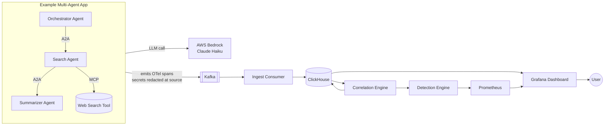

# Argos

**Distributed tracing for multiagent AI systems.** When a team of AI agents returns a wrong answer, Argos rebuilds the full story across every agent and every tool, so you can see *what* happened and *why*, not just that the result was wrong.


> **Status.** A working demo, built in public as a learning project by an aspiring cloud and platform engineer. The local stack runs end to end with one command and a guided console. It is not production hardened, and the roadmap below is honest about what is done and what is still planned.


---

## Table of contents

- [Overview](#overview)
- [The problem](#the-problem)
- [What Argos does](#what-argos-does)
- [Architecture](#architecture)
- [How a trace flows](#how-a-trace-flows)
- [Components](#components)
- [Technology stack](#technology-stack)
- [Security](#security)
- [Quickstart](#quickstart)
- [Instrumenting your own agents](#instrumenting-your-own-agents)
- [What the dashboard shows](#what-the-dashboard-shows)
- [Project status and roadmap](#project-status-and-roadmap)
- [Project structure](#project-structure)
- [Limitations](#limitations)
- [Contributing](#contributing)
- [License](#license)

---

## Overview

Modern AI applications no longer run as a single model call. A user request can fan out across an orchestrator agent, a search agent, several tools, and a summarizer. Increasingly, these agents hand work to one another over open protocols such as **MCP** (Model Context Protocol) and **A2A** (Agent to Agent). When the final answer is wrong, you are left with the answer and nothing else. You cannot see the dozen steps that produced it.

Argos applies **distributed tracing**, the same proven pattern that large cloud companies use to debug microservices, to teams of cooperating agents. It records every step each agent takes, stitches those scattered records into one causal timeline keyed by a shared trace id, stores them for fast querying, and shows the whole picture on a dashboard with cost per run and clear flags wherever something broke.

The interesting engineering here is not machine learning. It is a **distributed systems problem**: correlating events that arrive out of order, from independent processes, into a single coherent story. That is the platform and infrastructure lane, and it is what this project is built to demonstrate.

## The problem

Tools that observe a *single* agent already exist, and several are excellent. The gap appears the moment agents talk to each other. The steps of one user request scatter across multiple agents and tools, each emitting its own logs, and nobody reassembles them into one timeline. You can see that agent A failed, or that tool B returned nothing. What you cannot see is that tool B returned nothing on step three, and that everything after step three was doomed because of it.

Argos focuses on that **reassembly**. It treats a run as a tree of steps that share one trace id, rebuilds the parent and child relationships even when records arrive in any order, and surfaces the failure chain across agent boundaries.

## What Argos does

Think of a team of agents as employees in an office working on a task for you. They talk to each other, use tools, and come back with an answer, but you cannot watch them while they work. Argos is the security camera and the logbook for that office, and it does three jobs:

- **Record.** A small SDK sits beside your agents and writes down every step they take.
- **Organize.** A backend pipeline collects those scattered records and stitches them into one clean timeline.
- **Show.** A dashboard displays that timeline: who did what, in what order, how long it took, what it cost, and a red flag wherever something broke.

Everything technical in this document is simply how those three jobs are done well enough that someone else can run it too.

## Architecture

The system has three layers: an **SDK** that lives inside your application, a **backend pipeline** that runs as containers, and a **dashboard**. The diagram above shows how a span travels from your agents all the way to Grafana.

Read it as a story. The SDK records each step and publishes it to Kafka. Kafka safely carries the flood of records. The ingest consumer drains Kafka into ClickHouse. A watch loop reads spans, reconstructs the causal tree, writes the assembled trace back to ClickHouse, and reports any findings to Prometheus. Grafana reads from ClickHouse and Prometheus and draws the picture for a human.



## How a trace flows

This is the **failure scenario** from the bundled demo, where a tool keeps returning garbage and the search agent retries until it hits a safe cap. Every step is recorded under one shared trace id, so Argos can later show the exact point where the run went wrong.

In a normal tool you would see only that the task failed. In Argos, the retry loop shows up as a repeating run of failing tool calls, the detection rules flag a **runaway loop** and a **repeated tool failure**, and you can click straight to the step where it broke.

## Components

**The SDK.** A small Python package that lives inside your application. You wrap each agent step in a context manager and it emits one OpenTelemetry span per step, tagged with a shared trace id, covering tool calls, agent handoffs, model calls, and decisions. The whole point is that adoption stays two or three lines of code. It also **redacts secrets before any span leaves your machine**.

**The backend pipeline.** This is where the cloud engineering lives. Kafka is the ingestion buffer, so a burst of thousands of spans cannot overwhelm the system. The ingest consumer drains Kafka into ClickHouse using at least once delivery, so a restart never loses a span. The correlation engine groups every span that shares a trace id and rebuilds the causal tree, which is the part that single agent tools handle weakest. The detection layer scans assembled traces for runaway loops, repeated tool failures, and cost spikes, and exposes the results as Prometheus metrics.

**The dashboard.** Grafana, provisioned automatically from the repo. It reads from ClickHouse and Prometheus and draws the trace as a readable timeline and a left to right sequence diagram, with cost per run and panels that turn red when a finding fires. The dashboard is the small visible tip of the system; the backend is the substantial part.

## Technology stack

Each choice is deliberate. For several of them a lighter option would be enough at demo volume. They are included to practice the pattern that scales to production.

| Layer | Choice | Why |
|---|---|---|
| Instrumentation | OpenTelemetry (plus OpenInference) | Industry standard span format, interoperable |
| Language | Python | SDK, correlation engine, consumers |
| Demo agents | AWS Bedrock, Claude Haiku 4.5, MCP, A2A | The system being traced |
| Ingestion buffer | Apache Kafka | Standard for event streaming |
| Storage | ClickHouse | Columnar database for fast queries on huge trace volumes |
| Metrics and alerting | Prometheus | Common cloud metrics standard |
| Dashboards | Grafana | Free, professional, pairs with Prometheus and ClickHouse |
| Containers | Docker | Single command local stack |
| Orchestration | Kubernetes and Helm | *Planned, cloud phase* |
| Infrastructure as code | Terraform | *Planned, AWS phase* |
| CI | GitHub Actions | Tests on every push |
| Cloud target | AWS (EKS, MSK, S3) | *Planned* |

> **A note for interviews.** You do not strictly need Kafka or Kubernetes at this data volume. They are included on purpose to demonstrate the production pattern. The senior framing is to say exactly that: at this scale a lighter queue would be enough, and Kafka is here to show the design that scales. Knowing the tradeoff, not just the tool, is the signal.

## Security

The moment Argos records what agents do, it holds sensitive data: user questions, the data agents touched, API keys, and customer information. Recording it makes protecting it a responsibility, so security is treated as a feature rather than an afterthought.

- **Secret redaction.** The SDK automatically blanks passwords, API keys, and tokens *before a span ever leaves your machine*, using both a denylist of sensitive key names and pattern matching on values. The demo plants a fake secret on a span to prove the redaction runs on real traces.
- **Secrets never live in committed files.** AWS credentials come from the standard credential chain, either `aws configure` locally or an attached IAM role in the cloud. The config file holds only non secret settings, and the real config is ignored by git.
- **Planned hardening.** TLS in transit, encryption at rest, role based access control, and configurable data retention are on the roadmap, framed honestly as planned rather than shipped.

**What this project does not claim:** compliance certification, a formal security audit, or hardened isolation between tenants. Doing the obvious security well and being honest about the rest is the intent.

## Quickstart

The whole stack comes up with one Docker command, and a guided console walks you from a fresh clone to a live trace.

```bash
# 1. Clone
git clone https://github.com/<you>/argos.git
cd argos

# 2. Create and activate a virtual environment
python -m venv .venv
source .venv/bin/activate          # Windows PowerShell: .venv\Scripts\Activate.ps1

# 3. Install everything: the SDK, the backend pipeline, and the demo
pip install -r requirements-all.txt

# 4. Check your machine has the prerequisites
python -m argos setup

# 5. Open the guided console and follow the numbered steps
python -m argos
```

On a brand new clone you can skip steps 3 and 4 and run the bootstrap, which installs the dependencies for you and then runs the checker:

```bash
python scripts/bootstrap.py     # or  ./scripts/setup  (macOS, Linux),  scripts\setup.cmd  (Windows)
```

The guided console gives you a numbered menu:

```
1) Connect AWS           run aws configure (optional, the demo also runs in mock mode)
2) Start backend         docker compose up, health checked, plus the ingest consumer and detector
3) Instrument my agents  the one code change for your own app (writes argos.config.yml)
4) Run demo              emit real spans through the pipeline (happy or fail)
5) Open dashboard        Grafana at http://localhost:3000
6) Settings              view argos.config.yml
```

**Fastest path to a visible trace:** choose **2**, then **4**, then **5**. Start the backend, run the demo so spans actually flow, then open the dashboard. The dashboard is empty until spans arrive. The first run of option 2 also creates `argos.config.yml` if it is missing and starts the ingest consumer and detector in the background, so the dashboard fills in end to end with no extra terminals.

> **Prerequisites:** Docker, Python 3.10 or newer, and, for real agent runs, the AWS CLI with Amazon Bedrock model access enabled. On Windows, if `python` is not on your PATH, use the `py` launcher, since `scripts\setup.cmd` already prefers it. The first `docker compose up` downloads several images and Grafana plugins, so give it a few minutes on first boot.

## Instrumenting your own agents

Two imports, one startup call, and a context manager around each step you want to trace.

```python
from argos import init_tracing, trace_step

init_tracing()   # reads service_name and backend from argos.config.yml

with trace_step(agent_name="search", step_type="tool_call", name="web.search") as step:
    result = call_my_tool(query)
    step.set_usage(model="...", tokens_in=120, tokens_out=80)   # optional, for cost
```

`init_tracing()` takes no arguments. It reads the service name and span backend from `argos.config.yml`. Menu option **3** writes that file for you and prints these exact snippets with your own values filled in, then watches for your spans arriving so you get a clear confirmation it worked. With no backend set, spans print to the console; set the backend to `localhost:29092` to pipe them into the pipeline. The step type is one of `llm_call`, `tool_call`, `a2a_handoff`, or `decision`.

> **Note:** Argos traces multiagent apps you build **in code** (Python agents calling any LLM, over A2A and MCP). You add the snippets above to your own agent and run it. It does not reach into or instrument fully managed hosted agents that run inside a provider's service.

## What the dashboard shows

When the backend is running and a trace has flowed through, the Grafana dashboard shows the run several ways:

- **Trace detail.** Every step in execution order, indented to show the parent and child tree, with agent, type, duration, cost, status, and attributes.
- **Trace sequence.** A left to right Mermaid flow of the run, green for success and red for failure, so a retry loop shows up as an unmistakable run of red boxes.
- **Alarm row.** Critical findings, last run cost, and loop and tool failure gauges that turn red the moment a rule fires.
- **Cost and findings over time**, plus a recent runs table where failing traces are flagged at a glance.

> To show the live dashboard here, save a screenshot of your running stack to `docs/images/dashboard.png`.

## Project status and roadmap

Built in dependency order, so each phase ends with something you can run and show.

**Done and working in the local demo:**

- **Phase 0, Foundations.** Repo, Apache 2.0 license, issue templates, the Docker stack skeleton, and GitHub Actions running the tests.
- **Phase 1, SDK and a span.** The SDK, built on OpenTelemetry, emits structured spans for agent steps, with secret redaction from the start.
- **Phase 2, Ingestion pipeline.** Spans travel from the app through Kafka to ClickHouse and survive a restart.
- **Phase 3, Correlation engine.** Spans are grouped by trace id and stitched into a causal timeline across multiple agents and handoffs, with cost rolled up per run.
- **Phase 4, Detection and alerts.** Rules for runaway loops, repeated tool failures, and cost spikes export metrics to Prometheus.
- **Phase 5, Dashboard.** Grafana is provisioned automatically, with panels that go red when a finding fires.
- **Phase 6, Usability and the real demo.** A bundled multiagent research assistant on AWS Bedrock (orchestrator to search to summarizer, over A2A and MCP), a detailed trace view and a left to right sequence diagram, the AWS credential chain instead of secrets in files, a single config file, and a **guided console** that brings up the whole stack, consumer and detector included, and walks you through instrumenting your own agents.

**Planned:**

- **Phase 7, Cloud deployment.** Kubernetes manifests with a Helm chart, and Terraform for an AWS deployment.
- **Ongoing, Upstream contributions.** Fixing real gaps in the surrounding open source projects as they come up.

## Project structure

```
argos/
  README.md                   this file
  LICENSE                     Apache 2.0
  docker-compose.yml          single command local stack
  argos.config.example.yml    copy to argos.config.yml to configure
  requirements-all.txt        install the whole stack in one command
  scripts/                    bootstrap.py and the setup launchers
  .github/
    workflows/ci.yml          tests and build on every push
    CONTRIBUTING.md
  sdk/                        the Python SDK
    argos/
      tracing.py              span emission on OpenTelemetry
      redaction.py            secret blanking
      sinks.py                console and Kafka outputs
      config.py               the single config file reader
      protocols/              MCP and A2A span adapters
      cli/                    the guided console and setup checker
    tests/
  backend/                    the pipeline
    ingest/                   Kafka consumer
    correlation/              the causal stitching engine
    detection/                loop, failure, and cost rules
    storage/                  ClickHouse schema and access
    tests/
  examples/
    emit_bad_trace.py         emit a deliberately broken trace
    research-assistant/       bundled runnable multiagent demo
  deploy/
    grafana/                  dashboards and datasource provisioning
    prometheus/               scrape config
  docs/
    images/                   screenshots and diagrams
```

## Limitations

Argos is an open source project built to demonstrate and learn multiagent observability.

- It includes secret redaction, but it has not undergone a security audit for production use.
- It is not certified for any compliance regime such as SOC2 or HIPAA.
- It targets a focused set of scenarios, agents that cooperate over MCP and A2A, rather than every agent framework in existence, and it traces apps you build in code rather than fully managed hosted agents.
- It prioritizes depth on the correlation problem over broad feature coverage.

This honesty is intentional. A small tool that does one hard thing well, and says clearly what it does not do, is more credible than one that overpromises.

## Contributing

Contributions are welcome. This project is built in public on purpose.

- Read `.github/CONTRIBUTING.md` for setup and the development workflow.
- Good first issues are labeled `good first issue`.
- Open an issue before large changes so we can agree on direction.
- All contributions are under the Apache 2.0 license.

## License

Licensed under the Apache License 2.0. See [LICENSE](LICENSE) for details.
